# 📊 Gyanankur Retail Analysis Project

A cross-functional data analytics dashboard developed using **Python**, **JavaScript**, **SQL**, and **Power BI**, designed to evaluate retail metrics like customer trends, spending behavior, and profit margins across global segments and product categories.

---

## 📁 Project Structure

├── Gyanankur_Retail.csv
├── README.md
├── Retail Profit Margin Analyzer
|     ├── calculateProfitMargin.js
|     ├── profit_summary.csv
├── power bi
|     ├── IMG_20250623_232940-Picsart-AiImageEnhancer.jpg
├── python
|     ├── Retail_Analysis.py
|     ├── outputs
|     |     ├── IMG_20250623_065733.jpg
|     |     ├── IMG_20250623_065749.jpg
|     |     ├── IMG_20250623_065809.jpg
|     |     ├── IMG_20250623_065837.jpg
|     |     ├── IMG_20250623_065912.jpg
|     |     ├── IMG_20250623_065928.jpg
|     |     ├── IMG_20250623_065949.jpg
├── reports
|     ├── Retail Data Visualization.pdf
|     ├── Retail Insights Dashboard.pdf
|     ├── images
|     |     ├── !
|     |     ├── Retail Insights Dashboard_page-0002.jpg
|     |     ├── Retail Insights Dashboard_page-0003.jpg
|     |     ├── Retail Insights Dashboard_page-0004.jpg
|     |     ├── Retail Insights Dashboard_page-0005.jpg
|     |     ├── Retail Insights Dashboard_page-0006.jpg
|     |     ├── Retail Insights Dashboard_page-0007.jpg
|     |     ├── Retail Insights Dashboard_page-0008.jpg
|     |     ├── Retail Insights Dashboard_page-0009.jpg
|     |     ├── Retail Insights Dashboard_page-0010.jpg
|     |     ├── Retail Insights Dashboard_page-0011.jpg
|     |     ├── Retail Insights Dashboard_page-0012.jpg
|     |     ├── Retail Insights Dashboard_page-0013.jpg
|     |     ├── Retail Insights Dashboard_page-0014.jpg
|     |     ├── Retail Insights Dashboard_page-0015.jpg
|     |     ├── Retail Insights Dashboard_page-0016.jpg
|     |     ├── Retail Insights Dashboard_page-0017.jpg
|     |     ├── copilot_image_1750616511782.jpeg
|     |     ├── copilot_image_1750616513476.jpeg
|     |     ├── image_1750616737013.jpeg
├── sql
|     ├── output
|     |     ├── IMG_20250622_230727.png
|     |     ├── retail_output.md
|     ├── schema
|     |     ├── IMG_20250622_230709.png
|     |     ├── retail.sql
|     ├── tables
|     |     ├── IMG_20250622_230744.png
|     |     ├── show_tables.sql


---

## ✨ Key Features

- 📈 Interactive Dash App with Plotly & Dash
- 🧮 JavaScript-based category-level profit margin computation
- 💾 SQL queries for category, subcategory, and overall profit metrics
- 📊 Power BI dashboards and Python-generated visuals
- 📂 Organized structure for scalable exploration

---

## 🐍 Python: Data Processing & Dash App

```python
df = pd.read_csv('Gyanankur_Retail.csv')
df['Age Group'] = pd.cut(df['Age'], bins=[0, 20, 30, 45, 60, 100],
                         labels=['Teen', 'Young Adult', 'Adult', 'Senior', 'Elder'])

fig_map = px.choropleth(sales_by_country, locations='Country', color='TotalAmount')

app = dash.Dash(__name__)
app.layout = html.Div([
    html.H2('Retail Analytics Dashboard'),
    dcc.Graph(figure=fig_map),
    html.Img(src='violinsegmentgender.png', style={'width': '60%'})
])

```
---

## Python Visualizations

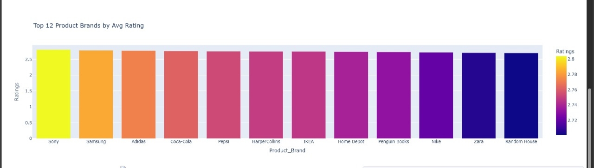
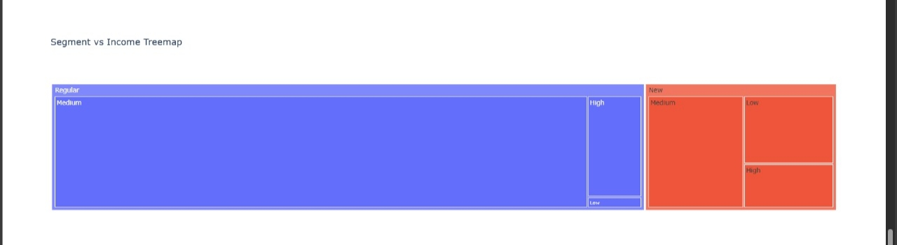
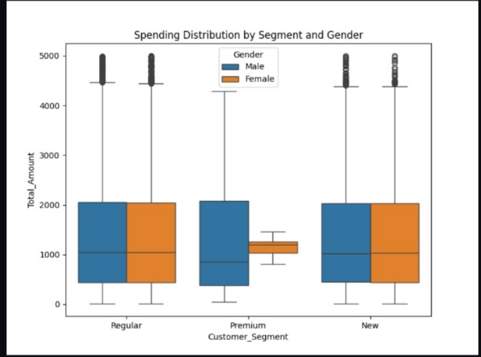
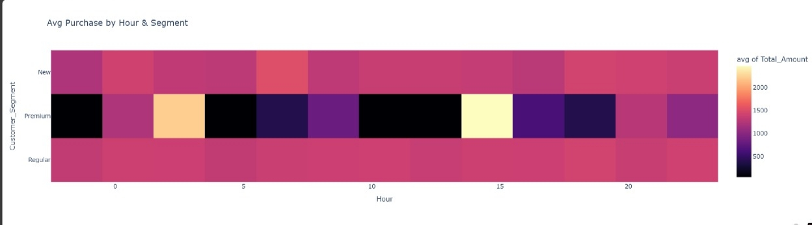
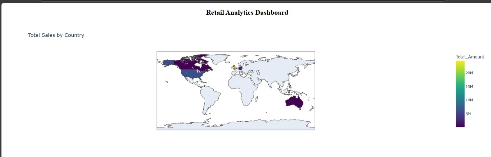

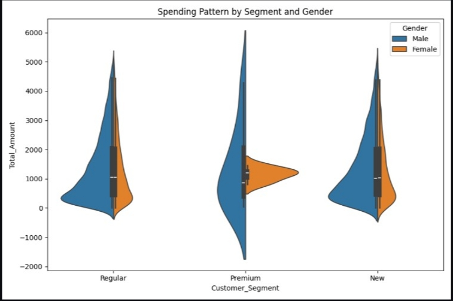

# 🧮 JavaScript: Profit Margin Calculator

```javascript

const categoryMargins = {};
// Reading CSV and calculating average margins

fs.createReadStream('Gyanankur_Retail.csv')
  .pipe(csv())
  .on('data', (row) => {
    const cost = parseFloat(row.Amount);
    const revenue = parseFloat(row.Total_Amount);
    const key = `${row.ProductCategory || 'Unknown'} > ${row.ProductType || 'Unknown'}`;
    // ... margin logic
  })
  .on('end', () => {
    fs.writeFile('profit_summary.csv', ...);
    console.table(summary);
  });

```
# 🔍 Sample Output (from profit_summary.csv)

```csv
CategorySubcategory	AvgProfit_Margin	Entries

Clothing > Shorts	69.96%	505
Electronics > Tablet	68.88%	1041
Home Decor > Tools	71.51%	491
Grocery > Juice	69.23%	1014
Unknown Category > Jacket	90.00%	1

```

---

# 📂 SQL: Profit Margin Queries

```sql

SELECT 
    Category,
    SUM(Sales) AS Category_Sales,
    SUM(Profit) AS Category_Profit,
    ROUND(SUM(Profit) * 100.0 / NULLIF(SUM(Sales), 0), 2) AS CategoryProfitMargin_Percent
FROM 
    retail_data
GROUP BY 
    Category
ORDER BY 
    Category;

```
---

## SQL Visuals 

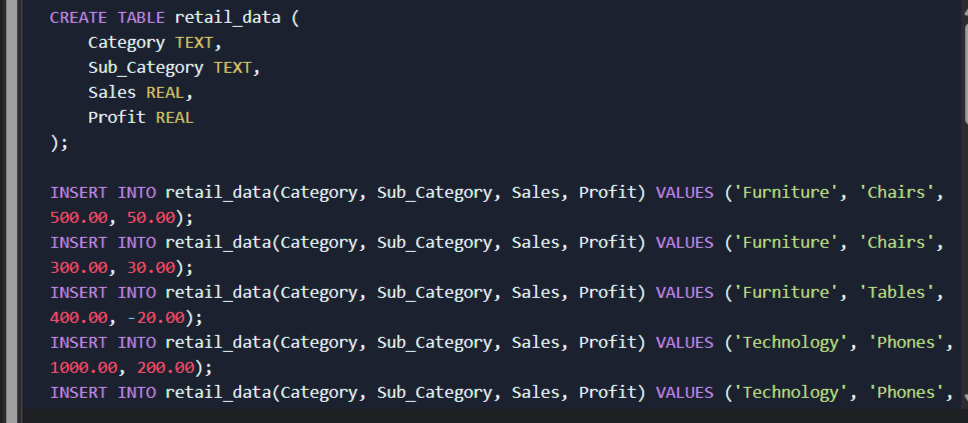
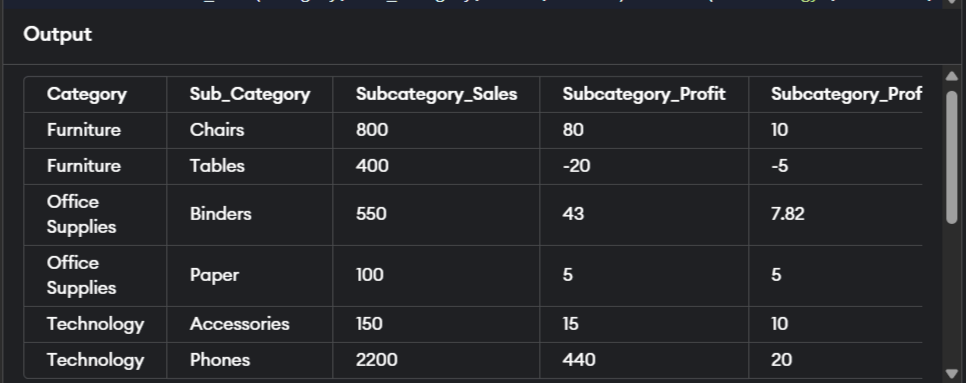


# 📸 Visual Gallery

## 🧭 Power BI Dashboard


# 📘 Reports & Dashboards

## 📘 Retail Data Visualization (PDF)

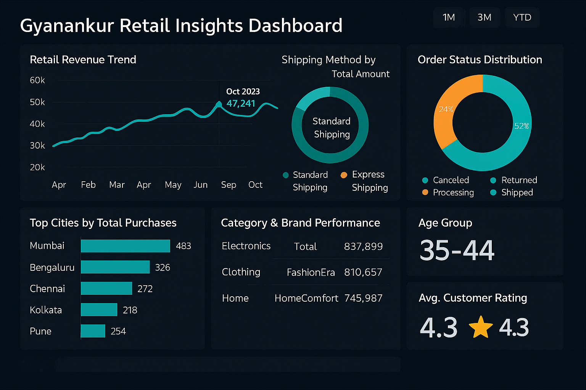
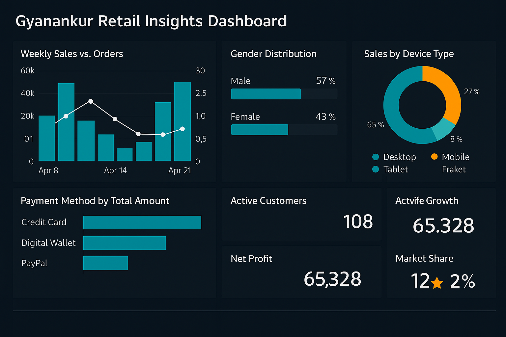
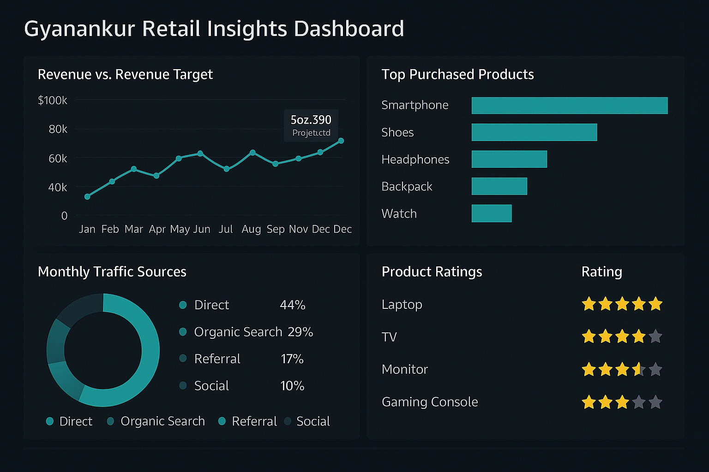

## 📗 Retail Insights Dashboard (PDF)

<h3>Retail Insights Dashboard (Pages from PDF)</h3>


# 👤 Author & License

GitHub: @Gyanankur23
License: MIT License


---

# 🔖 Hashtags (Markdown Friendly)

#RetailAnalytics #PowerBI #DataScience #PythonDash #SQLAnalytics #ProfitMargin #BusinessIntelligence #JS #EDA #RetailDashboard #CustomerSegmentation #GyanankurBaruah
