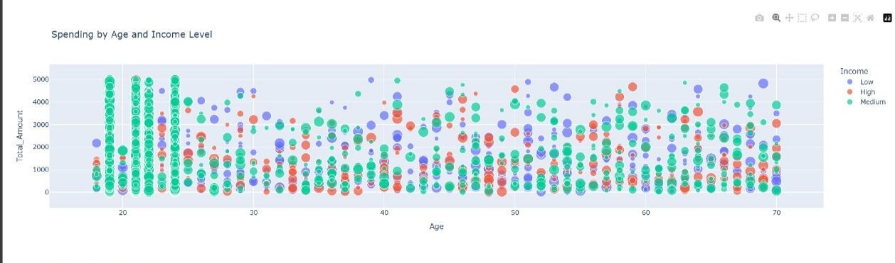

# 📊 Retail Analysis Project

A cross-functional data analytics dashboard developed using **Python**, **JavaScript**, **SQL**, and **Power BI**, designed to evaluate retail metrics like customer trends, spending behavior, and profit margins across global segments and product categories.

---

## 📁 Project Structure

├── Gyanankur_Retail.csv
├── README.md 
├── Retail Profit Margin Analyzer │  
├── calculateProfitMargin.js │   
├── profit_summary.csv 
├── power bi │   
├── IMG20250623232940-Picsart-AiImageEnhancer.jpg
├── python │  
├── Retail_Analysis.py 
│   ├── outputs 
│   │   ├── IMG20250623065733.jpg 
│   │   ├── IMG20250623065749.jpg
│   │   ├── IMG20250623065809.jpg 
│   │   ├── IMG20250623065837.jpg
│   │   ├── IMG20250623065912.jpg 
│   │   ├── IMG20250623065928.jpg
│   │   ├── IMG20250623065949.jpg 
├── reports │   
├── Retail Data Visualization.pdf 
│   
├── Retail Insights Dashboard.pdf
├── sql 
│   ├── output 
│   │   ├── IMG20250622230727.png 
│   │   ├── retail_output.md │   
├── schema 
│   │   ├── IMG20250622230709.png
│   │   ├── retail.sql 
│   ├── tables 
│   │   ├── IMG20250622230744.png
│   │   ├── show_tables.sql

---

## ✨ Key Features

- 📈 Interactive Dash App with Plotly & Dash
- 🧮 JavaScript-based category-level profit margin computation
- 💾 SQL queries for category, subcategory, and overall profit metrics
- 📊 Power BI dashboards and Python-generated visuals
- 📂 Organized structure for scalable exploration

---

## 🐍 Python: Data Processing & Dash App

```python
df = pd.read_csv('Gyanankur_Retail.csv')
df['Age Group'] = pd.cut(df['Age'], bins=[0, 20, 30, 45, 60, 100],
                         labels=['Teen', 'Young Adult', 'Adult', 'Senior', 'Elder'])

fig_map = px.choropleth(sales_by_country, locations='Country', color='TotalAmount')

app = dash.Dash(__name__)
app.layout = html.Div([
    html.H2('Retail Analytics Dashboard'),
    dcc.Graph(figure=fig_map),
    html.Img(src='violinsegmentgender.png', style={'width': '60%'})
])

```
---

## Python Visualizations





🧮 JavaScript: Profit Margin Calculator

```javascript

const categoryMargins = {};
// Reading CSV and calculating average margins

fs.createReadStream('Gyanankur_Retail.csv')
  .pipe(csv())
  .on('data', (row) => {
    const cost = parseFloat(row.Amount);
    const revenue = parseFloat(row.Total_Amount);
    const key = `${row.ProductCategory || 'Unknown'} > ${row.ProductType || 'Unknown'}`;
    // ... margin logic
  })
  .on('end', () => {
    fs.writeFile('profit_summary.csv', ...);
    console.table(summary);
  });

```
🔍 Sample Output (from profit_summary.csv)

```csv
CategorySubcategory	AvgProfit_Margin	Entries

Clothing > Shorts	69.96%	505
Electronics > Tablet	68.88%	1041
Home Decor > Tools	71.51%	491
Grocery > Juice	69.23%	1014
Unknown Category > Jacket	90.00%	1

```

---

📂 SQL: Profit Margin Queries

```sql

SELECT 
    Category,
    SUM(Sales) AS Category_Sales,
    SUM(Profit) AS Category_Profit,
    ROUND(SUM(Profit) * 100.0 / NULLIF(SUM(Sales), 0), 2) AS CategoryProfitMargin_Percent
FROM 
    retail_data
GROUP BY 
    Category
ORDER BY 
    Category;

```
---

## SQL Visuals 


📸 Visual Gallery

🧭 Power BI Dashboard


📘 Reports & Dashboards

📘 Retail Data Visualization (PDF)

📗 Retail Insights Dashboard (PDF)


 Dashboard.pdf	📗 Retail Insights Dashboard


👤 Author & License

GitHub: @Gyanankur23
License: MIT License


---

🔖 Hashtags (Markdown Friendly)

#RetailAnalytics #PowerBI #DataScience #PythonDash #SQLAnalytics #ProfitMargin #BusinessIntelligence #JS #EDA #RetailDashboard #CustomerSegmentation #GyanankurBaruah
